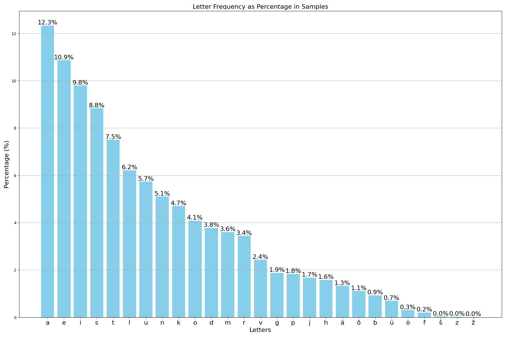

# Eesti-tahtede-statistika
Uurin Eesti tähestiku tähtede statistikat sõnastikus ja kirjanduses, et arendada paremat klaviatuuri eestikeelset paigutust ehk *layout*-i.

Projektis kasutan Eesti keele Ühendkorpuse andmestiku *clean* versiooni, kus on morfoloolilised sildid eemaldatud. 

Andmestikkus filtreerimist ei toimu (näiteks kõik võõrsõnade või nimede/kohtade eemaldamine), kuna prioriteet on luua klaviatuuri jaoks paigutus ning selle kasutamisel tuleb ette see, et peab ka võõrsõnu kasutama.

Kuna andmestik on 20Gb suur, siis võtan ainult miljon esimest lauset. Katsetades tähtede jaotus ei muutunud väga kui minna näiteks 100lt lauselt 10 tuhande peale, mida on ka oodata, kuna keelte puhul tähtede ja sõnade jaotus on suhteliselt konstantne.

Graafikul on näidatud tähtede sagedused protsentidena.

Edasiseks oleks hea anlüüsida, mis tähed on üksteiste kõrval, et vähendada sõrmede liikumist klaviatuuril. Kuid ma arvan esimeseks lähendiks on lithne tähtede jaotuse leidmine piisav. 

Klaviatuuri paigutuse jaoks kasutan lehekülge keybr.com, kus saab endale kohandada paigutust. Leheküljel on ka võimalus kasutada klaviatuuri kirjutades eestikeelseid sõnu ning selle tulemusena ka saada statistikat kirjutamise kiirusest.

Andmestiku viide: Koppel, Kristina; Kallas, Jelena (2022). Eesti keele ühendkorpus 2021. DOI: 10.15155/3-00-0000-0000-0000-08E60L
https://huggingface.co/datasets/siimh/estonian_corpus_2021
